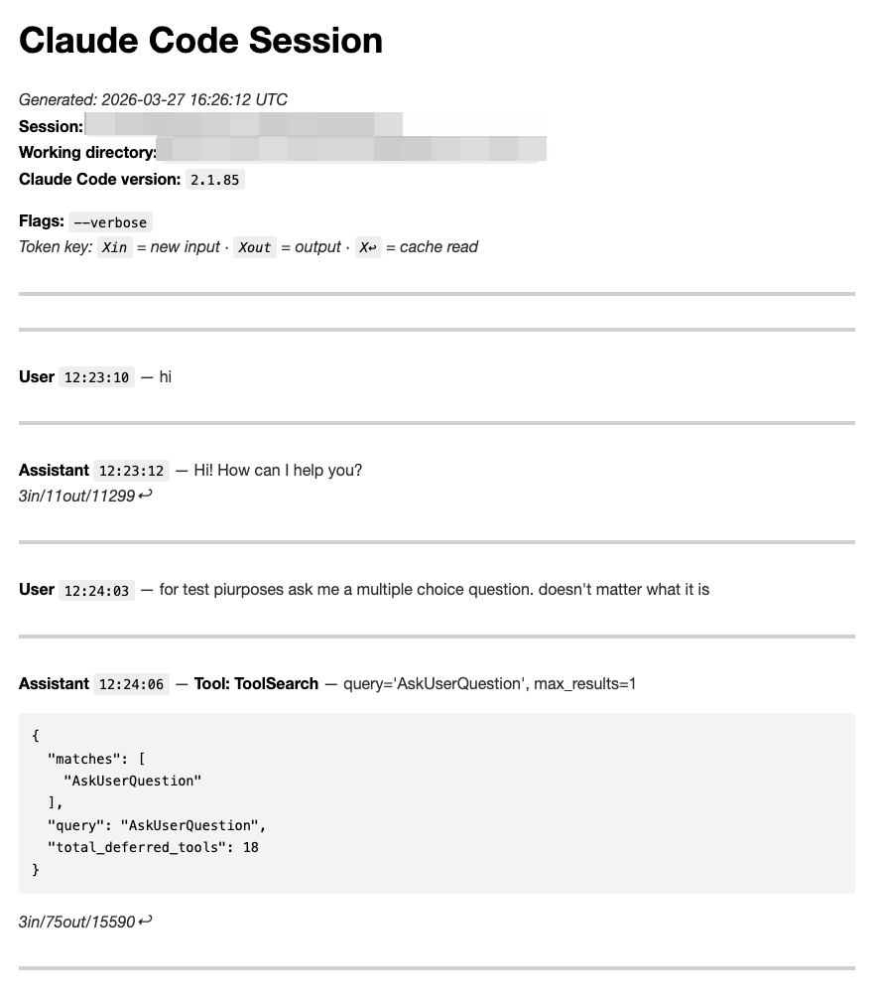
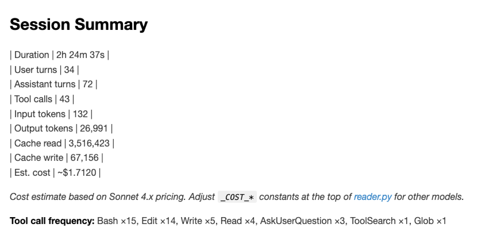

# clauderead

> Turn Claude Code session logs into readable, shareable Markdown transcripts.

Raw Claude Code `.jsonl` session files are useful, but they are not pleasant to inspect directly. **clauderead** converts them into clean Markdown that is easy to skim, easy to share with another engineer, and structured enough to hand to another AI for review.

- No install step
- No dependencies
- Single-file Python tool
- Works on individual sessions, whole directories, and glob patterns

| Transcript Preview |
|---|
|  |
| *Transcript output with timestamps, tool calls, token usage, and optional verbose tool results.* |

## Quick Start

```bash
git clone https://github.com/robShankin/clauderead.git
cd clauderead
python3 reader.py ~/.claude/projects/-Users-you-myproject/abc123.jsonl
```

That writes `output/abc123.md` in the current directory.

Run with `--stdout` to print to the terminal instead:

```bash
python3 reader.py ~/.claude/projects/-Users-you-myproject/abc123.jsonl --stdout
```

> [!TIP]
> `clauderead` is stdlib-only. If you already have Python 3.7+, you already have everything you need.

## What You Get

- A readable transcript with speaker labels and timestamps
- Tool calls rendered inline with key inputs
- Optional full tool output via `--verbose`
- Per-session token totals, estimated cost, and tool frequency
- Batch conversion and directory listing for browsing many sessions

| Session Summary Preview |
|---|
|  |
| *Session summaries show duration, turns, token usage, estimated cost, and tool frequency at a glance.* |

## Prerequisites

**Python 3.7 or newer**. Nothing else.

```bash
python3 --version
```

No Python installed yet? Download it from [python.org](https://www.python.org/downloads/).

## Finding Your Session Files

Claude Code stores sessions here:

| OS | Path |
|----|------|
| macOS / Linux | `~/.claude/projects/` |
| Windows | `%USERPROFILE%\.claude\projects\` |

Each project gets its own subfolder named after its path, with slashes replaced by dashes:

```text
~/.claude/projects/
  -Users-you-myproject/
    abc123.jsonl
    def456.jsonl
```

> [!NOTE]
> `.claude` is a hidden directory. On macOS/Linux, run `ls -a ~`. On Windows, enable "Show hidden files" in Explorer.

A few things worth knowing:

- There is one `.jsonl` file per session, not per project.
- Logs live in Claude Code's global storage, not inside your git repo.
- Anthropic may change the storage path or structure in future releases.

## Usage

### Common Commands

| Task | Command |
|------|---------|
| Convert one session to Markdown | `python3 reader.py session.jsonl` |
| Print one session to the terminal | `python3 reader.py session.jsonl --stdout` |
| Include full tool output | `python3 reader.py session.jsonl --verbose` |
| Include thinking blocks | `python3 reader.py session.jsonl --thinking` |
| Convert all sessions in a directory | `python3 reader.py ~/.claude/projects/-Users-you-myproject/` |
| List sessions without converting | `python3 reader.py ~/.claude/projects/ --list` |
| Convert by glob pattern | `python3 reader.py "~/.claude/projects/-Users-you-myproject/*.jsonl"` |

For a single file, output is written under `./output/` in the current working directory. For directory and glob conversions, each source directory gets its own adjacent `output/` folder. Existing files are never overwritten; names increment automatically, for example `abc123-02.md`, `abc123-03.md`, and so on.

### Flag Reference

| Flag | Effect |
|------|--------|
| `--stdout` | Print to terminal instead of writing a file |
| `--verbose` | Include full tool output, truncated at 1000 characters |
| `--thinking` | Show Claude thinking blocks when present, though they are usually redacted |
| `--list` | List all sessions in a directory with metadata instead of converting |
| `--tail N` | Show only the last `N` turns |
| `--head N` | Show only the first `N` turns |

Flags can be combined:

```bash
python3 reader.py abc123.jsonl --verbose --thinking --stdout
python3 reader.py abc123.jsonl --tail 20 --stdout
```

### Notes on Specific Flags

`--verbose` adds the raw tool output beneath each tool call in a fenced code block. This is useful when you want to inspect what Claude actually read, ran, or returned.

`--thinking` includes thinking blocks when they are present in the log. In practice, Claude Code usually writes these blocks with redacted content, so you will normally see `*(thinking redacted)*` rather than the original text.

`--tail` and `--head` are useful for very long sessions. The rendered output includes a note explaining how many turns were omitted, while session totals still reflect the full underlying log.

## Output Format

Each transcript starts with a metadata header that includes:

- A generated timestamp
- Session ID
- Working directory
- Claude Code version
- Active flags
- A token usage key

Each turn is rendered in a compact, readable format:

```text
***
**User** `12:24:03` — for test purposes ask me a multiple choice question.

***
**Assistant** `12:24:10` — **AskUserQuestion** — What is the capital of France? [Paris / Lyon / Marseille / Bordeaux] → **Paris**
*3in/193out/15624↩*
```

- `***` separates turns
- Speaker names are bolded
- Timestamps appear inline with each turn
- Assistant turns include token counts when usage data is present
- Tool calls are rendered inline with key inputs
- `--verbose` adds the raw tool payload under each tool call
- Turns containing tool errors are marked with `**[!]**`

Each session ends with a summary block:

| Field | What it shows |
|-------|---------------|
| Duration | Wall-clock time from first to last turn |
| Turns | User turns and assistant turns |
| Tool calls | Total count plus a frequency breakdown |
| Tokens | Input, output, cache read, and cache write |
| Estimated cost | Approximate cost based on Sonnet 4.x pricing constants in `reader.py` |

## Agent Sublogs

Claude Code agent workflows can produce sublog files where every record is marked as a sidechain. Without special handling, those files would render as empty output because the normal filter strips sidechain records.

`clauderead` detects that case automatically. If filtering sidechains would leave nothing to render, it falls back to rendering the full file. That means you can point it at both normal sessions and agent sublogs without needing a separate command.

## What Gets Omitted by Default

| Omitted | How to include |
|---------|----------------|
| `file-history-snapshot` records | Not includable; internal bookkeeping only |
| `thinking` blocks | `--thinking` |
| Raw tool result payloads | `--verbose` |
| Sidechain records in mixed files | Not needed; standalone agent sublogs are detected automatically |

## Cost Estimate Notes

Estimated cost uses the `_COST_*` constants at the top of `reader.py`. If Anthropic changes pricing, or if you want to estimate against a different model, update those constants to match your environment.
